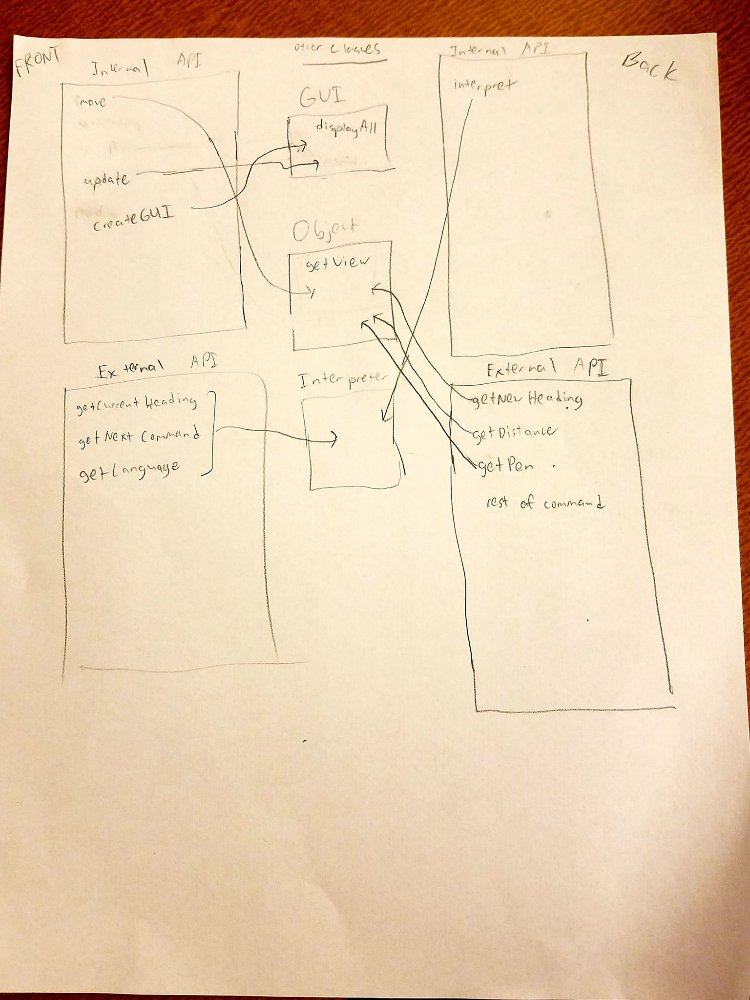
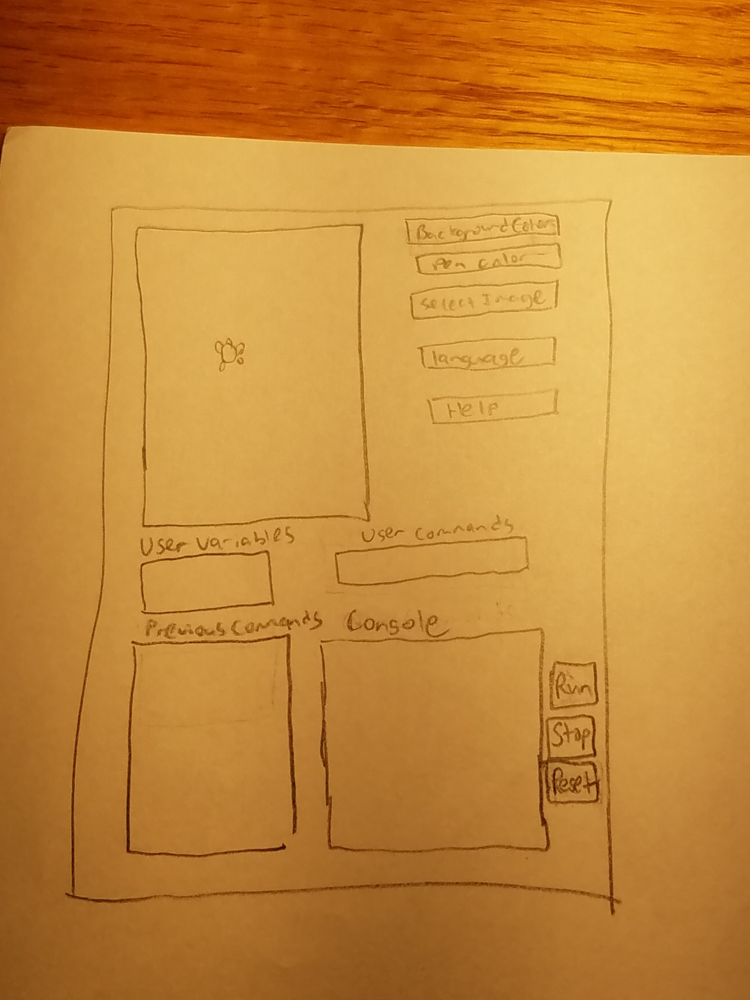

SLogo Plan
===
## Introduction
Through this program, our team will solve the problem of allowing users to control a turtle throught the commands they type in on an interactive graphical interface for the program to execute. This includes commands for having a turtle move on screen.

One primary design goal is to create an application programing interface (API) to allow the front end and the back end to implement without worrying about the other team's code and to create. The other design goal is to create a GUI program where the division between the back-end and front-end are very clear and communicate well with each other.

The primary architecture is a front-end module and a back-end module. Each of these will have an external API and an internal API. The external API's will be the communicators between the front and back-ends. The internal API's will help extend the modules themselves for future features/requirements. 

At a high level, the internal API for the front end contains methods to help create the GUI class and methods to move the turtle on the screen. The external API for the front end contains methods to get information from the object (its current heading) and the GUI (commands and language), which will be given to the interpreter class. The internal API for the backend contains methods to help the interpreter interpret the commainds. The external API for the backend contains methods to change the objects state.

## Design Overview

Our front-end internal API will have an update() method that will be used by the GUI to update its visual turtle display after each command, a createGUI() method which will initialize the components required for the GUI to take in UI, and a move() method that will be used by the Object (turtle) class to change its position.

The front-end external API will have getCurrentHeading(), getNextCommand(), and getLanguage() methods that will be called by an Model class to retrieve information from the UI (console, buttons, etc). The Model class will tell the Object to update to its new states (pen, distance, heading)

The back-end internal API will have an interpret() method (a complex method that will likely have several helpers) that will do the actual parsing of commands into a series of movements the Object can execute and the GUI can display. 

The back-end external API will have getNewHeading(), getDistance(), getPen(), and the rest of the possible commands as methods. These methods will be used by the generic Object (turtle) class to establish its properties after each command. 



## User Interface
The user will interact with the program by typing commands into the console. If the user creates a variable or a command, then the textbox "user variables" or "user commands" will disply the created variable or command. When the user clicks run button, the commands will be executed and the turtle will move accordingly on the scene. When the user clicks the home button, the turtle will return to the point (0,0). When the user clicks the clear button, the turtle returns to the point (0,0), and the screen is cleared of any pens.

The user can also set the language, pen color, or background color via the dropdown boxes. The user can set the image of the turtle by clicking the select image button and choosing the appropriate image file. 

If the command is invalid, the program will display an alert saying that the command is invalid and stop running. If any other error occurs, then again, an alert will be displayed for that error.



## API Details 

Our front-end internal API will support different GUI and turtle object elements. The update() method will be used by the GUI to update how the turtle is displayed on screen as a command executes, the createGUI() method will initialize the GUI and set up its individual components, and the move() method will be used by the turtle to change its position. This API can be extended to accomodate different ways the turtle will move or different ways to configure the GUI. There may be errors thrown when moving the turtle off the screen or to impossible positions. This API is needed to process the different commands given by the user.

Our front-end external API will support the different options that users have in customizing the GUI as well as communicate user input to the back-end. For example, the getCurrentHeading(), getNextCommand(), and getLanguage() methods will be called by an Model class to retrieve information from the UI (console, buttons, etc). The Model class will relay the information to either the GUI class to change what is displayed (background color, language, etc.) or the Object class to update its status (pen, distance, heading). This API may make use of ResourceBundles for the text displayed in the GUI. It can also be extended to support even more customizations for the GUI. Potential errors thrown include not finding the right data files to retrieve information from. This API is needed to communicate information from the front-end to the back-end so that the back-end can work properly.

Our back-end internal API will support how the program processes user commands. The interpret() method will parse user input into a series of instructions that the Object class can execute and that the GUI can display. This API can potentially be extended to support different instruction formats or languages. Most of the error handling will come with this API since it will need to watch for incorrect or impossible commands. This API is needed to parse and interpret the commands typed by the user properly so that the program can execute.

Our back-end external API will support the different commands the GUI will display. Methods like getNewHeading(), getDistance(), and getPen() can be used by the GUI in generating what happens on screen. They will also be used by the generic Object (turtle) class to help determine what its properties are after each command. This API can potentially be extended to support new commands. This API is needed to communicate information from the back-end to the front-end so that the front-end can work properly.

## API Example Code

When the user enters 'fd 50' in the command window:
```java
MainController Class - createGUI() from InternalFrontEnd
Model Class - getNextCommand(),  getLanguage(), and getCurrentHeading() from ExternalFrontEnd 
                    - returns the commmand, what language it is written in, and what the current direction is
                  - interpret() from InternalBackEnd
                    - returns the command parsed into forward movement and 50 steps
                  - tells object to update itself
Object(turtle) Class - getNewHeading() from ExternalBackEnd
                       - calculates and returns rotated direction
                     - getDistance() from ExternalBackEnd
                       - returns distance
                     - move() from InternalFrontend
                         - calculates the Objects movement
GUI Class - displayAll()
            - update() from InternalFrontEnd
                - returns states of all Objects
            - getView() from Object class
                - gets Objects view when updated  
            - createGUI from InternalFrontEnd
                - draw all images

```
When an invalid command is passed:
```java
Model Class - getNextCommand(),  getLanguage(), and getCurrentHeading() from ExternalFrontEnd 
                    - returns the commmand, what language it is written in, and what the current direction is
                  - interpret() from InternalBackEnd
                    - throws error upon parsing incorrect syntax and displays error to the user

```
When a command is entered:
```java
Model Class - getNextCommand(),  getLanguage(), and getCurrentHeading() from ExternalFrontEnd 
                    - returns the commmand, what language it is written in, and what the current direction is
                  - interpret() from InternalBackEnd
                    - returns the command parsed

```
When the GUI is moving the turtle:
```java
Object(turtle) Class - getNewHeading() from ExternalBackEnd
                       - calculates and returns rotated direction
                     - getDistance() from ExternalBackEnd
                       - returns distance 

MainController Class - update() from ExternalFrontEnd
                        - displays the turtle moving

```
When the GUI does not draw the turtle's trail:
```java
Object(turtle) Class - getNewHeading() from ExternalBackEnd
                       - calculates and returns rotated direction
                     - getDistance() from ExternalBackEnd
                       - returns distance 
                     - getPen() from ExternalBackEnd
                         - returns not having pen draw a trail

MainController Class - update() from ExternalFrontEnd
                        - displays the turtle moving without a trail
```
When the user changes the language:
```java
MainController Class - createGui() from InternalFrontEnd
                        - GUI text will be replaced by the selected language
```
When the user changes the pen color:
```java
MainController Class - createGui() from InternalFrontEnd
                        - Sets pen color so that future pen trails will be that color
```

When the user queries the turtle's heading:
```java
Model Class - getNextCommand(),  getLanguage(), and getCurrentHeading() from ExternalFrontEnd 
                    - returns the commmand, what language it is written in, and what the current direction is
                  - interpret() from InternalBackEnd
                    - returns the command parsed
MainController Class - The heading is printed in the console
```
When the user queries the language:
```java
Model Class - getNextCommand(),  getLanguage(), and getCurrentHeading() from ExternalFrontEnd 
                    - returns the commmand, what language it is written in, and what the current direction is
                  - interpret() from InternalBackEnd
                    - returns the command parsed
MainController Class - The language name is printed in the console
```
## Design Considerations 

The design decisions focused on two large areas: 1) Should a method should be placed in an API or a class and 2) if a method should be placed in an API, then which API (front end vs. back end and internal vs external) should the method be placed.

One method debated was the "createGUI" methods (listed as one for planning purposes but will most likely contain multiple methods). If the method was placed in the class, no duplicated code would be needed and all of the GUI methods could be contained in one class. However, if the GUI class adds other methods, the class may become too messy. It was decided to place the "createGUI" methods in the internal front-end API because to make the GUI class much cleaner and more readable. 

Another method debated was whether the "getPen" method should be used in the GUI class or the Object class. The pro of using it in the GUI class is that the pen is not an object and placing it in the GUI class can make the Object class more clear and more sensible. The pro of using it in the Object class is that the pen follows the object, and so the pen can be listed as a property of the object.  The latter was chosen because it was thought to be cleaner to have the pen created as a property of the object. 


## Team Responsibilities
To complete this project, we plan to split the four APIs between each of the four of us. We will also have two subteams. Orgil and Austin will form the front-end subteam and Russell and Allen will form the back-end subteam. Each subteam will work on the classes exclusive to their assigned module.

Individual Responsibilities:  
Orgil  
* primary: front-end external
* secondary: front-end internal 

Austin  
* primary: front-end internal
* secondary: front-end external

Allen  
* primary: back-end internal
* secondary: back-end external

Russell
* primary: back-end external
* secondary: back-end internal